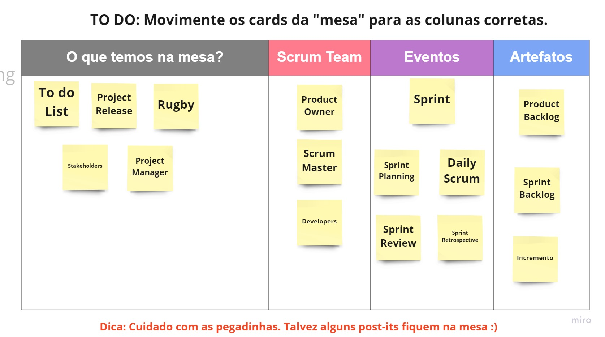

# Desafio de Projeto - SCRUM

## Desafio

Projeto desenvolvido durante o Bootcamp Formação Scrum Master Certificate com objetivo de Fixar os Pilares e Valores do Scrum, bem como reforçar os aspectos fundamentais do Framework Scrum:

- Responsabilidades
- Eventos
- Artefatos.

Para garantir esta absorção foi necessário o prenchimento dos quadros localizados no projeto base de [Leonardo Ropelato](https://miro.com/app/board/uXjVPahls68=/?share_link_id=956189813435).

Para visualizar o desenvolvimento no MIRO acesse, [Valdir Alves](https://miro.com/app/board/uXjVPJ4VF8s=/).

## Autor

<a href="https://github.com/valdir-alves3000/">
 
  
 <b>Valdir Alves </b>🚀</a>

Feito com ❤️ por Valdir Alves. Entre em contato!

